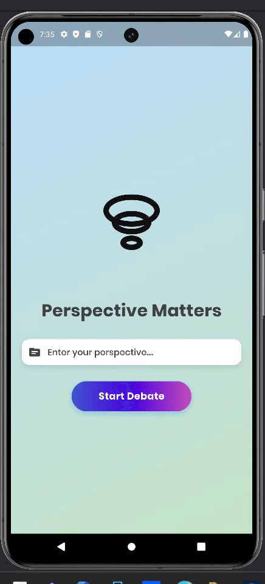

# Perspective Matters: Healing Social Divides Through AI 🌍
[](https://perspectivemattersnssce.streamlit.app/)
> 

## About the Project 🌟

Perspective Matters is a an impactful application built using Flutter that revolutionizes the way we engage with differing viewpoints. By leveraging the power of Google's Gemini AI, this app creates an intelligent debate platform where two AI agents engage in structured discourse, challenging our preconceptions and broadening our understanding of complex topics.

## 🌟 Social Impact at the Core

In a world increasingly fragmented by polarization, Perspective Matters emerges as a powerful tool for social healing and understanding.
An App where Two AI Agents debate against each other on any valid topic providing a wider perspective about the topic to the general public.

### How We Create Social Good 🤝

#### Breaking Down Ideological Walls
- **Problem**: Societal echo chambers that divide communities
- **Solution**: AI-powered platform that systematically breaks down barriers by showing two sides of a specific topic or perspective
- **Impact**: Creates empathy by exposing users to diverse perspectives

#### Combating Intellectual Isolation
- **Challenge**: People trapped in narrow worldviews
- **Intervention**: Intelligent debates that challenge preset thinking
- **Outcome**: Expanded understanding and reduced social friction

#### Developing Collective Intelligence
- **Goal**: Rebuild communication across social divides
- **Method**: Structured AI dialogues that model respectful disagreement
- **Result**: Restored faith in meaningful dialogue

## 🖥️ Technical Details and Functionality

## How It Works 🛠️

### 1. Topic Validation
- User inputs a debate topic
- Gemini AI performs intelligent filtering
- Screens out inappropriate or dangerous topics
- Ensures meaningful discourse parameters

### 2. Dual AI Debate System
```
User Input → Validation → Pro AI Agent ⚔️ Con AI Agent → Structured Debate
```
> 

### 3. Safety Features
- Smart content filtering
- Eliminating Harmful Topics
  
  

### App Architecture
- **Framework**: Flutter 
- **AI Engine**: Google Gemini AI
- **Platforms**: Mobile (Android)


## 📫 Join the Movement

- **Email**: contactashharps@gmail.com

Together, we can rebuild social bridges, one perspective at a time promoting Social Good
